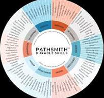

# 【Day 01】AI 賦能的時代，我們究竟該學 AI，還是學會如何學習？

## 知識是一張網，我們卻只能線性地走進去

學習一個新的知識不是一件非常容易的事，因為知識本來的樣子是一張網，每個概念都跟其他概念互相牽連，沒有固定的起點，也沒有固定的終點。但人的學習沒辦法這樣做。我們只能一天一天、一步一步，沿著時間軸往前走，像在網子上先是走出一條線，然後不斷地在不同知識點上來回的探索，讓知識逐漸內化成為自己可以掌握的樣態。

這系列的 30 天，就是我想示範如何用一條線狀的個人學習經驗，藉由生活中會遇到的情境，慢慢理解AI的知識點，並引導大家逐步去思考，進而變成能自我學習的樣態。當然不同人有不同的經驗與理解，在這一系列的文章僅為個人經驗分享。

## 為什麼是現在？

今年 2 月，前 Google 台灣董事總經理簡立峰在全國大學校長會議上的一段分享，在教育圈引起不小的討論。他提到，AI 時代的新鮮人離開校園後，可能只剩下很短的時間，要把過去得花兩年才學得會的職場知識吸收完，否則就撐不過試用期。（[原文出處：天下雜誌](https://www.cw.com.tw/article/5139859)）

他還說了一句我很有感觸的話：「寬的能力，大於深的能力」。在 AI 什麼都能回答的時代，人類真正不可外包的能力，不是記憶，而是「問得對，才會有好答案」。當然還有返回了答案後，人是否有相對的品味來辨識答案的真偽。

這句話某種程度上，就是這整個系列想討論的事——我們當然還是要學 AI，但更關鍵的，是把學 AI 的過程，變成練習提問、判斷與快速適應的場域。這也是為什麼，這系列的重點不會只是工具教學，而是想陪你重新練習「怎麼學會學習」這件事。

## 我，一個沒有資工背景的學習者

我走完了台灣的高等教育路線，也曾在業界服務過，也體驗過求職的低潮。我不是資工背景出身，也不是一開始就懂這些技術名詞的人。我可以理解學習一個新知識會產生的摩擦力，畢竟學習總是痛苦的。

正因為這樣，我想用自己這一路摸索 AI 的經驗，寫給跟我一樣、不是本科出身，但也想搞懂這波浪潮的人看，以及還在學的學生。藉由大量的觀察以及反思，讓大家都能有基礎的駕馭AI這項未來重要的核心技能，來迎接未來的職場。如果你也曾經覺得「這些名詞好像很重要，但完全看不懂從何學起」，或是即是看了大量的網路資源也還理不清頭緒的人，希望這一系列能幫到你。

## 未來人才的技能樹，大到沒有人點得完

在個人學習的途徑中，曾聽過李海碩總校長的演講，分享了 [Pathsmith](https://www.pathsmith.org/) 的框架，把「未來人才需要的軟實力」拆解成 10 大能力領域、將近 100 個具體的關鍵字／子技能：溝通（Communication）、協作（Collaboration）、品格（Character）、正念／覺察（Mindfulness）、元認知（Metacognition）、領導（Leadership）、成長心態（Growth Mindset）、堅韌（Fortitude）、批判性思考（Critical Thinking）、創造力（Creativity）。

*圖片來源：[Pathsmith by America Succeeds](https://www.pathsmith.org/tools/)*

看到這張圖的當下，我的第一個念頭是：這根本是人生遊戲的技能樹。後來仔細看說明才發現，這其實是彙整全體職場需求畫出來的地圖，不是要求每個人都要點滿——但就算只是「假設一個人真的想全部點滿」，光用想的就覺得不可能。

## 除非你是人格分裂，或者剛好是個 MoE

要把這 10 大領域、近 100 個子技能全部點滿，大概只有兩種可能：一是人格分裂，讓每個人格分別去點不同的技能樹；二是你用了 AI 界的 MoE（Mixture of Experts，混合專家架構）——內建一堆虛擬專家，每個專家負責不同的軟實力，需要誰就叫誰出來。（MoE 是什麼，我們後面談 LLM 架構的時候會再細講，這裡先讓這個詞混個眼熟就好。）

但我只是一個人，沒有那麼多分身，所以我做了取捨。

## 所以我只挑了四個

從這張「整體職場需求地圖」裡，我為自己的 AI 學習之路，抽出最常用到的四個：

- **批判性思考（Critical Thinking）**：不照單全收，會問「真的是這樣嗎」
- **元認知（Metacognition）**：知道自己是怎麼學會的，也知道自己卡在哪裡
- **成長心態＋好奇心（Growth Mindset + Curiosity）**：願意一直試錯，不怕答案是錯的
- **一點點堅韌（Fortitude）**：能忍受不確定，也能忍受失敗

這四個不是我覺得「最重要」的四個，而是在自己學習AI的旅程中，這四個是反覆會被拿出來使用的技能。它們具體是怎麼被使用的，就從下面這個方法開始說起。

## 我怎麼做：觀察、反思、迭代

這系列會不斷回來的節奏：觀察一件事、停下來想一想、再試一次。學一個新知識是這樣，跟 AI 互動時所需要的核心能力也是這樣——觀察 AI 給的回答，靠的是批判性思考去檢查；反思自己卡在哪裡，靠的是元認知去定位；想不通就換個問法再試一次，靠的是成長心態和好奇心；試了好幾次還是卡住、還願意撐住不放棄，靠的是堅韌。之後每次講到這個節奏，我都會請你跟我一起停下來想一想，而不是我講完就結束。

## 接下來，我們要去哪

這 30 天，我大致會從「AI 是怎麼運作的」開始，走到「怎麼讓它幫你做事」，再走到「怎麼認識不同的 AI 生態系」，最後落到「怎麼把這些工具變成你自己的學習方法」。詳細的每日主題，我會照進度更新在系列頁上。

如果你也想知道，一個非資工背景的人，怎麼用 30 天走出一條屬於自己的學習路線，歡迎追蹤這個系列，我們明天見。

## 目錄（每日更新）

第一部：一個非電資背景者如何開始理解 AI

| 天數 | 標題 | 摘要 |
| --- | --- | --- |
| Day 1 | AI 賦能的時代，我們究竟該學 AI，還是學會如何學習？ | 簡介 |

---

**參考資料**
- 簡立峰．〈學不夠快，就等著被淘汰！簡立峰：未來畢業生，最需要的是「適應力」〉，《天下雜誌》，2026-02-24。https://www.cw.com.tw/article/5139859
- Pathsmith™ Durable Skills Framework，America Succeeds。https://www.pathsmith.org/
