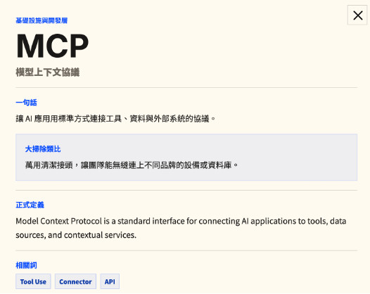
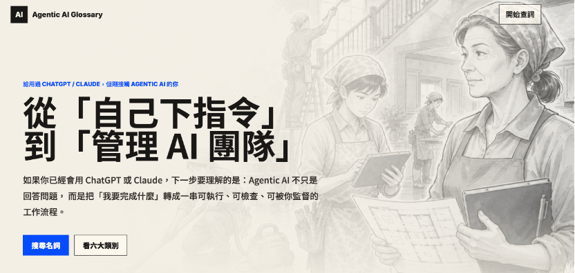

# 【Day 05】我開始聽不懂了：用類比建立 AI 專有名詞的鷹架

## 昨天還在看 AI 的內心戲，今天開始聽不懂它在說什麼

前幾天，我們一路談了 Token、Embedding、Transformer、Fine-tuning、In-context Learning、Chain-of-Thought 與 Reasoning Model。

如果這些名詞你都已經記得很熟，恭喜你。

如果你開始覺得：

> 每個字單獨看好像都認識，放在同一句話裡卻完全看不懂。

也恭喜你，這通常代表你真的開始進入一個新的領域了。這章還會端出更多名詞；先快速瀏覽即可，以後遇到名詞再回來查。

學習初期最麻煩的地方，不一定是概念本身有多困難，而是專有名詞會彼此牽連。你查一個不懂的詞，解釋裡又冒出三個新詞；再點進其中一個，旁邊又站著 API、SDK、RAG、MCP 與 Orchestration。原本只是想知道 Agent 是什麼，最後卻像誤闖一場縮寫聯誼會，而且每個人都只肯用英文名字自我介紹。

當陌生名詞越來越多，學習的摩擦力也會快速上升。因為我們不只是要理解新概念，還得同時記住每個名詞的位置、彼此的關係，以及它們究竟在整個系統裡負責什麼。

這時候，我不會要求自己立刻背下所有正式定義，而是先做一件事（不是關電腦躺平⋯⋯）：

> **用自己目前可以接受的說法，替整個領域搭一個暫時可用的框架。**

## 專有名詞最難的，不是翻譯，而是沒有位置

假設第一次看到 **MCP（Model Context Protocol）**，查到的解釋是：

> 一種讓 AI 應用以標準方式連接外部工具、資料來源與服務的協議。

每個字都是中文，但讀完之後，腦中可能仍然只剩下：

> 好，這是一種……協議(os:好想關機)。

問題不是定義錯了，而是我們腦中還沒有一張地圖，不知道「協議」在這套系統中位於哪裡，也不知道它和 API、Tool、Agent 之間有什麼關係。

一個新名詞如果沒有可以依附的位置，就像第一次走進大型五金行。眼前每一件東西都有名字，但你不知道哪一區是水電、哪一區是木工，也不知道手上的問題究竟需要螺絲起子還是老虎鉗，還是直接來一把+8神器的鐵製土牆，暴力破開一切阻礙。

所以在學習一個新領域時，我自己會先追求兩件事：

1. **這個名詞大概屬於哪一區？**
2. **它在整個流程裡扮演什麼角色？**

先有位置，再補精確定義，通常比一開始背百科全書有效。

## 類比不是答案，而是一座臨時鷹架

類比的作用，不是證明兩件事完全一樣，而是借用熟悉的事物，暫時支撐我們理解陌生的概念。

建築物施工時會先搭鷹架。鷹架不是房子本身，但工人可以站在上面工作；等建築逐漸穩固之後，鷹架就可以拆掉。

學習時的類比也一樣。

例如，我們可以把 Token 想成樂高積木，把 Token ID 想成置物櫃號碼，把 Chain-of-Thought 想成計算紙。這些說法都不完整，但它們能先讓腦中出現一個可操作的畫面。

等理解加深之後，我們再慢慢把：

> 「MCP 像萬用接頭」

換回：

> 「MCP 是 AI 應用連接工具與資料來源的標準化協議。」

因此，類比不是要取代正式定義，而是讓我們有機會走到正式定義面前，而不是在半路就關掉網頁。

*圖：以生活語言與正式定義並列的 MAP 名詞卡。*

## 我把 Agentic AI 想成一次大掃除

為了理解 Agentic AI，我替自己建立了一個共同場景 [Agentic AI Glossary](https://github.com/geomingical/Agentic_AI_Glossary)。：

> **把完成一項複雜工作，想成完成一次大掃除。**

這個類比不是要把 AI 說成清潔員，而是用一個大家相對熟悉的場景，觀察不同角色如何分工。（會選這個情境，只是因為建立學習鷹架時剛好在農曆年前⋯⋯你也可以把框架換成自己熟悉的場景。）

我先把 AI 的使用方式分成三個層次：

### 傳統程式：一支掃把

你推一下，它動一下。

規則清楚、結果可預期，但它不會自己判斷下一步。程式只會按照事先寫好的流程執行，就像掃把不會突然發現窗戶很髒，然後自己去找玻璃清潔劑。

### AI 的對話模式 Chat Mode（一位聰明助手）

這是大家使用 ChatGPT 或 Claude 最熟悉的方式。

你可以請它整理資訊、草擬文章、回答問題或協助思考。不過互動的主導權依然在你身上，你需要持續給予方向：先做這件事、再修改那一段、最後幫我整理成表格。

它非常聰明，但運作型態就像坐在你旁邊的特助，隨時等待你交代下一個步驟。

### Agentic AI 任務模式（一支清潔團隊）

你交付的不再只是單一步驟，而是一個最終目標，例如：

> 明天下午有人來家裡，請把客廳整理到可以招待客人的程度。

系統需要判斷目前狀況、拆解任務、安排順序、使用工具、查找資料、檢查結果，遇到高風險事項時再回來詢問你。

這時候，我們就可以開始替專有名詞安排位置。

## 把名詞放回大掃除的現場

在這個框架中，一些常見名詞可以先這樣理解：

| 專有名詞 | 大掃除類比 | 在系統中的角色 |
| --- | --- | --- |
| **LLM** | 受過訓練的大腦 | 理解指令、生成文字、判斷下一步 |
| **Agent** | 被分派任務的清潔專家 | 根據目標採取行動並回報結果 |
| **Manager Agent** | 清潔領班 | 拆解任務、分派工作、整合結果 |
| **Goal** | 把客廳整理到能招待客人 | 系統最後要達成的結果 |
| **Planning** | 決定先整理桌面還是先吸地 | 安排完成目標所需的步驟 |
| **Task Decomposition** | 拆成丟垃圾、擦窗、吸地與拖地 | 把大任務切成可執行的小任務 |
| **Workflow** | 一張大掃除流程表 | 定義工作的順序、判斷與交接 |
| **Tool** | 掃把、吸塵器、梯子與水管鉗 | 讓 AI 能操作外部功能 |
| **Function Calling** | 領班填寫工單，叫水管師傅處理 | 讓模型用結構化資料要求程式執行功能 |
| **API** | 對外聯絡的服務窗口 | 讓不同程式交換資料或呼叫服務 |
| **MCP** | 可以連接不同設備的標準接頭 | 讓 AI 應用用一致方式連接工具與資料 |
| **RAG** | 翻閱清潔手冊與過去維修紀錄 | 先找外部資料，再根據資料回答 |
| **Context** | 目前攤在工作桌上的資訊 | 模型這一輪可以參考的內容 |
| **Memory** | 工作紀錄與屋主偏好 | 保存之後可能需要再次使用的資訊 |
| **Guardrails** | 禁區、操作規範與安全守則 | 限制系統不能做什麼 |
| **Human-in-the-loop** | 碰到保險箱時請屋主決定 | 在高風險或關鍵節點交回人類確認 |
| **Evaluation** | 屋主驗收 | 判斷結果是否符合要求 |

這張表不是考試標準答案，而是一張暫時的配置圖。

它最重要的功能，是讓我們看到每個名詞不是各自漂浮在空中，而是在同一個系統中互相配合。

## 當一句話塞滿專有名詞時，先把它翻回生活語言

假設你讀到一句話：

> Manager Agent 會根據 Goal 進行 Task Decomposition，再透過 MCP 呼叫 Tools，使用 RAG 取得資料，最後由 Human-in-the-loop 進行確認。

第一次看可能很像工程師在施放組合技（可以說人話嗎？）。

但放回大掃除的框架後，它其實是在說：

> 領班先理解屋主要什麼，把大掃除拆成幾項工作，再透過標準接頭叫用需要的設備，翻閱手冊與過去清潔紀錄，最後把高風險的決定（例如：放有梅西簽名球的那個櫃子要不要打掃？）交回屋主確認。

等生活語言看懂之後，再換回正式名詞：

1. 誰負責協調？——Manager Agent
2. 它依據什麼工作？——Goal
3. 如何把事情變小？——Task Decomposition
4. 如何接上外部能力？——MCP 與 Tools
5. 如何補充模型原本不知道的資料？——RAG
6. 誰負責最後的關鍵決定？——Human-in-the-loop

同一句話經過一次翻譯後，名詞不再只是密碼，而開始形成一個可以想像的工作流程。

## 我自己做了一本可以重複翻閱的名詞本

根據這套大掃除類比，我把名詞整理成六個區域：

1. **基礎設施與開發層**：模型、Agent、API、框架與系統編排
2. **思考、推理與規劃**：目標、拆解、推理、反思與自主性
3. **工具、技能與資源**：Tool Use、RAG、知識庫與外部系統連接
4. **記憶與上下文**：Context Window、短期記憶、長期記憶與狀態
5. **效能、評估與異常**：成本、延遲、評估、幻覺與可觀測性
6. **安全、防護與治理**：權限、護欄、提示注入、隱私與稽核

每張名詞卡不只放中文翻譯，而是依序提供：

* 一句話說明
* 大掃除類比
* 正式定義
* 相關名詞

這個順序是刻意的。

因為學習初期，我不一定有能力直接吃下正式定義。先從一句話與類比建立畫面，再回到技術定義與相關詞，摩擦力會小很多。

*圖：Agentic AI Glossary 首頁，以清潔團隊呈現從單次指令到管理 AI 團隊的概念。*

## 名詞本不是看完一次，而是允許自己一直回去查

學習新領域時，一直忘記才是正常的；但隨著反覆接觸，每一次理解都會逐漸加深，最後成為記憶的一部分。

第一次看到 MCP，我可能只記得「萬用接頭」；第二次在實作中看到，才開始理解它和 Tool、Resource、Server、Client 的關係；第三次真的安裝 MCP Server，才知道原來前面的類比只幫我走到門口，裡面還有很多房間。

所以學習初期，我自己會反覆翻閱同一份名詞本。

可以使用下面這個循環：

1. **遇到陌生詞**：先不要急著背完整定義
2. **找到它的位置**：它屬於模型、推理、工具、記憶、評估，還是安全？
3. **讀生活類比**：先讓腦中出現一個畫面
4. **回到正式定義**：確認類比省略了哪些細節
5. **連接相關名詞**：看看它和前後概念如何合作
6. **在實際使用後重看一次**：用新的經驗更新理解

同一個名詞在不同階段，看起來會不太一樣。

這不是原本沒學會，而是理解正在增加解析度。

## 類比也會騙人，所以要知道它在哪裡失效

類比很好用，但也有風險。

Agent 不是真的人，沒有像清潔員一樣的生活經驗與責任感；Memory 也不是人類記憶，可能只是資料庫裡的一筆紀錄；RAG 並不等於「模型查過資料就一定正確」，檢索可能找錯文件，模型也可能錯誤解讀內容。

MCP 像萬用接頭，但它不是一條實體電線；Chain-of-Thought 像計算紙，但可見的文字不一定完整反映模型內部計算。

因此，每一個類比後面都應該接著問：

> **它和真正的技術概念，哪裡相似？又從哪裡開始不一樣？**

好的類比會幫我們進門；壞的類比則可能在門口直接蓋一間假房子，讓我們以為已經理解整棟建築。

所以我的做法不是永遠停留在「MCP 就是萬用接頭」，而是先靠這句話找到位置，再逐步加入正式定義、使用情境與限制。

## 停下來想一想

當我們聽不懂一個領域時，很容易把問題歸因成：

> 我是不是不夠聰明？

但很多時候，或許只是還沒有建立可以承接新名詞的框架。

專家看到 RAG、MCP、Agent、Context 與 Guardrails，腦中浮現的是一張彼此連接的系統圖；初學者看到的，則可能只是五個需要單獨背誦的英文縮寫。

學習的其中一個任務，就是慢慢把這些孤立名詞接成一張網。

類比不會讓我們立刻成為專家，但它可以降低第一次接觸的摩擦力，讓我們願意繼續看下去，而不會一直想關電腦（誤）。等實作經驗逐漸增加，原本簡單的比喻就會被更精確的理解取代。

這也呼應了這個系列一直在做的事：

> **先觀察自己卡在哪裡，再替學習設計一個比較走得下去的方法。**

過去我自己閱讀新領域的學術文章時，也會按照類似流程：先把文章交給 AI，為專有名詞找出類比鷹架，再回到後續閱讀。

**明天**，我們會從名詞本裡拿出 Function Calling，看看當語言模型不只回答文字，而是能用結構化方式叫程式執行功能時，它如何開始從「會說」走向「會做」。

---

**延伸閱讀與工具**
* [Agentic AI Glossary 線上名詞圖鑑](https://geomingical.github.io/Agentic_AI_Glossary/)
